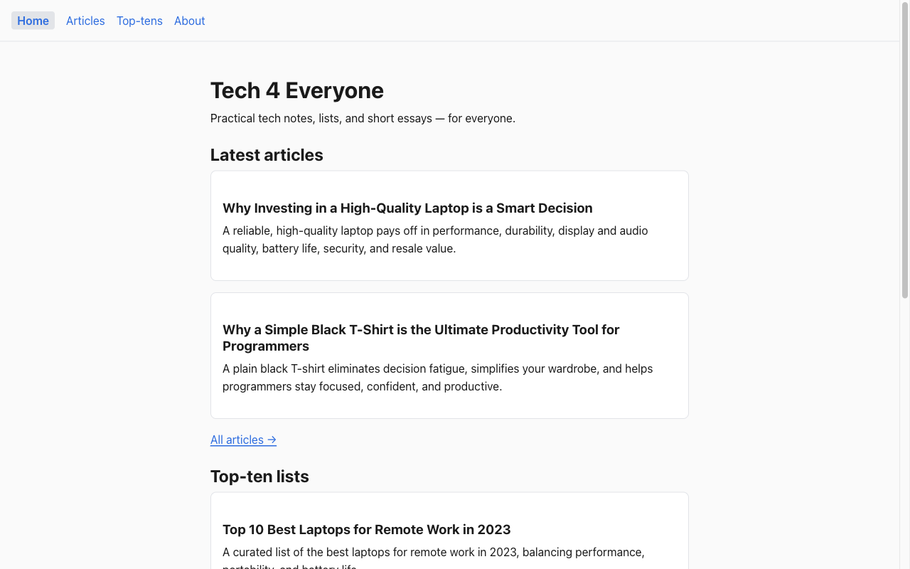

# tech-4-everyone

> A small, opinionated Angular 20 SPA — a tech-content blog built as a portfolio piece, kept intentionally readable end-to-end.

[](https://github.com/Hustree/tech-4-everyone/actions/workflows/ci.yml)
[](https://github.com/Hustree/tech-4-everyone/actions/workflows/codeql.yml)
[](https://hustree.github.io/tech-4-everyone/)
[](LICENSE)



**Live:** <https://hustree.github.io/tech-4-everyone/>

## What this is

A tiny tech-content blog — top-ten lists and short articles. Intentionally small, so the whole codebase reads in one sitting. Showcases modern Angular idioms (standalone components, signals, the new `@if`/`@for` control flow, the `application` builder), a strict content-as-code architecture, and an a11y-first design system built on CSS custom properties.

Sibling in spirit to [`pdf-esign-starter`](https://github.com/Hustree/pdf-esign-starter) and [`e2e-payload-encryption-starter`](https://github.com/Hustree/e2e-payload-encryption-starter).

## Stack

| Layer | Tech |
|---|---|
| Framework | Angular 20 (standalone, signals, new control flow, `application` builder) |
| Language | TypeScript 5.5+ |
| Styling | SCSS + CSS custom-property design tokens (light + dark) |
| Content | Markdown (`marked` + `DOMPurify`) for articles; typed TS for top-ten lists |
| Tests | Karma + Jasmine |
| CI | GitHub Actions: build/lint/test, CodeQL, Dependabot, Lighthouse a11y |
| Hosting | GitHub Pages (auto-deploy on `main`) |
| License | MIT |

## Quick start

```bash
git clone https://github.com/Hustree/tech-4-everyone.git
cd tech-4-everyone
npm install
npm start
```

Then open <http://localhost:4200>.

| Task | Command |
|---|---|
| Dev server | `npm start` |
| Production build | `npm run build` |
| Pages build (with `base-href`) | `npm run build:pages` |
| Unit tests | `npm test -- --watch=false --browsers=ChromeHeadless` |
| Lint | `npm run lint` |

## Highlights

- **Content-as-code.** Top-ten lists are typed TypeScript; articles are Markdown files with YAML frontmatter, imported as raw strings and rendered through a sanitized `<app-markdown>` component.
- **Modern Angular.** Standalone components, signals end-to-end, `@if`/`@for` control flow, lazy-loaded routes, the new `application` builder.
- **A11y-first.** Semantic HTML, skip link to `<main>`, visible `:focus-visible` rings, color-contrast tokens, `prefers-reduced-motion` honored. Lighthouse a11y ≥ 95 enforced in CI.
- **Design tokens.** All visual decisions go through CSS custom properties in `src/styles/_tokens.scss` — light + dark via `prefers-color-scheme`.
- **CI hygiene.** Build/lint/test on every PR, weekly CodeQL TypeScript scans, Dependabot for npm + Actions, Lighthouse a11y check.
- **Auto-deploy.** Push to `main` → GitHub Pages deploy via Actions.

## Repo layout

```
tech-4-everyone/
├── src/
│   ├── app/
│   │   ├── core/        ContentService (signals)
│   │   ├── shared/      MarkdownComponent
│   │   ├── content/     types, top-tens.ts, articles.ts, articles/*.md
│   │   └── features/    home, about, articles, top-tens, not-found
│   └── styles/          _tokens, _reset, _a11y partials
├── docs/                architecture, content authoring, a11y notes
├── .github/             CI, CodeQL, Pages deploy, Dependabot, templates
├── AGENTS.md            repo orientation for contributors
├── CONTRIBUTING.md
├── SECURITY.md
└── LICENSE              MIT
```

## Documentation

- [`AGENTS.md`](AGENTS.md) — orientation for anyone making changes (architecture invariants, where things live, CI gates)
- [Architecture](docs/architecture.md) — routing, content model, design tokens
- [Content authoring](docs/content-authoring.md) — how to add an article or top-ten list
- [Accessibility](docs/accessibility.md) — what we commit to and how it's enforced

## Contributing

See [CONTRIBUTING.md](CONTRIBUTING.md). Commits follow [Conventional Commits](https://www.conventionalcommits.org/). All PRs require green CI.

## Security

See [SECURITY.md](SECURITY.md) for how to report vulnerabilities.

## License

MIT — see [LICENSE](LICENSE).
